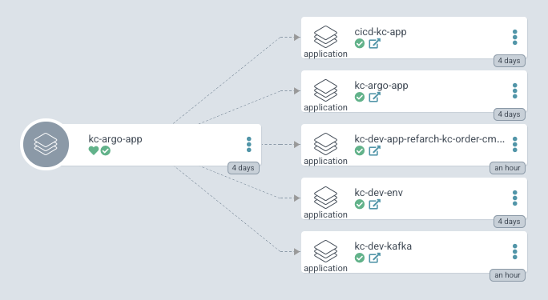

# KC solution gitops

IBM Event Driven Architecture reference implementation GitOps repository, in support of https://ibm-cloud-architecture.github.io/refarch-eda/

This gitops repository supports three types of deployments of the solution, one using
Strimzi Kafka to run on OpenShift, one with Event Streams with Cloud Pak for Integration,
and one with Event Streams Managed service on IBM Cloud.

The microservices of the solutions are deployed to OpenShift and connect to the Kafka deployment
you use.

Updated 09/14/2021.

## Considerations

As presented in the [product documentation](https://www.ibm.com/docs/en/cloud-paks/cp-integration/2021.2?topic=installation-structuring-your-deployment),
"Considerations before deployment", we have to assess user roles and platform requirements.

Here are the assumptions we define for the `kc-solution`:

* Single admin team for OCP cluster and production projects within the cluster.
* Developers manages staging and dev environment. This is a functional team developing the `kc-solution`
* For the solution one gitops will define all environments and apps/services of the solution.  
* Developers will not have access to OpenShift cluster administration
* Cloud Pak for integration operators are installed in all namespaces, and there is only one instance of
each operator. 
* Only one Platform Navigator installed per cluster (in all namespaces) and it displays instances of
 capabilities from the whole cluster.
* `ibm-common-services` is unique to the cluster. 

For real production deployment, the production OpenShift cluster will be separate from dev and staging, running in different infrastructure.

## Pre-requisites

* Access to an OpenShift 4.7 or later. You can use the bring your own app [Red Hat OpenShift on IBM Cloud](https://developer.ibm.com/openlabs/openshift)
* [Logging in to the OpenShift CLI](https://docs.openshift.com/container-platform/4.7/cli_reference/openshift_cli/getting-started-cli.html#cli-logging-in_cli-developer-commands)
* Optional [install the Argo CD CLI](https://argoproj.github.io/argo-cd/cli_installation/)
* Install the [kubeseal CLI](https://github.com/bitnami-labs/sealed-secrets#homebrew)
* Install KAM CLI


## Event Streams with Cloud Pak for Integration

The Cloud Pak for Integration installation is documented here and a [cloud pak gitops repository](https://github.com/IBM/cloudpak-gitops/blob/main/docs/install.md) helps to
automate deployment.

### "Manual deployment of event-streams"

In this section we just focusing on deploying Event Streams within an OpenShift with IBM Catalog defined.

* Get IBM product catalog added to your OpenShift cluster

```sh
# To verify they are not already installed use:
oc get operators
# If you do not see any IBM operators then install IBM Catalog definition
oc apply -f ./ibm-catalog/subscription.yaml
```

* Obtain [IBM license entitlement key](https://github.com/IBM/cloudpak-gitops/blob/main/docs/install.md#obtain-an-entitlement-key)

If you just want event-streams and dependant operators deployed use the following:

```sh
# deploy dependent operators if not done before
oc apply -f https://raw.githubusercontent.com/ibm-cloud-architecture/eda-gitops-catalog/main/cp4i-operators/asset-repo.yaml
oc apply -f https://raw.githubusercontent.com/ibm-cloud-architecture/eda-gitops-catalog/main/cp4i-operators/automation-foundation.yaml
oc apply -f https://raw.githubusercontent.com/ibm-cloud-architecture/eda-gitops-catalog/main/cp4i-operators/common-services.yaml
oc apply -f https://raw.githubusercontent.com/ibm-cloud-architecture/eda-gitops-catalog/main/cp4i-operators/couchdb.yaml

# deploy event streams operator
oc apply -f https://raw.githubusercontent.com/ibm-cloud-architecture/eda-gitops-catalog/main/cp4i-operators/event-streams/subscription.yaml   
```

Now create users and cluster using manifests declaration. For example the `es-stage` environment defines a shared
cluster:

```sh
oc apply -k environments/kc-stage/apps/event-streams
```

### Automating deployment with ArgoCD

The manual steps to bootstrap this ci/cd process are:

1. [Install the openShift GitOps Operator](https://docs.openshift.com/container-platform/4.7/cicd/gitops/installing-openshift-gitops.html#installing-gitops-operator-in-web-console_getting-started-with-openshift-gitops).
1. Obtain [IBM license entitlement key](https://github.com/IBM/cloudpak-gitops/blob/main/docs/install.md#obtain-an-entitlement-key)
1. [Update the OCP global pull secret of the `openshift-config` project](https://github.com/IBM/cloudpak-gitops/blob/main/docs/install.md#update-the-ocp-global-pull-secret)
1. Use our bootstrap folder to initiate the GitOps

    ```sh
    # Reference ibm catalog
    oc apply -k https://raw.githubusercontent.com/ibm-cloud-architecture/eda-gitops-catalog/main/ibm-catalog/kustomization.yaml
    # Install OpenShift pipeline and sealed-secrets
    oc create -k bootstrap/cicd
    # NOT TESTED YET need release 2021.3 Install CP4I operators
    # oc create -k bootstrap/cp4i
    # Bootstrap solution environment
    oc apply -k bootstrap/kc-solution
    # Create a secrets for entitlement key
    oc create secret docker-registry ibm-entitlement-key \
        --docker-username=cp \
        --docker-server=cp.icr.io \
        --namespace=kc-dev \
        --docker-password=entitlement_key 

    ```

1. Bootstrap the argocd app of app within an argoCD project named `kc-solution`using the command

```sh
oc apply -k config/argocd
```
1. Log to ArgoCD console: See the exposed route in the openshift-gitops project

```sh
oc get route openshift-gitops-server -n openshift-gitops -o jsonpath='{.saliaspec.host}'
# Get argoadmin password
oc extract secret/openshift-gitops-cluster -n openshift-gitops --to=-
```
Once logged to the console, you should see the `kc-argo-app` synced or performing synch operation.



## Draft notes

* Update structure using KAM
* Add Strimzi operators and cluster instance manifest in environments/strimzi
* Add quarkus pipelines

### Issues encountered

* Strimzi operator not installed via argocd app
* openshift-gitops-argocd-application-controller service account need to be able to create or patch resource under target namespace 

```sh
# verify service account
oc get sa
# Verify existing cluster role
oc get clusterrole
# select the cluster role like below and do under the openshift-gitops project
oc adm policy add-cluster-role-to-user  strimzi-cluster-operator.v0.25.0-strimzi-cluster-ope-65df8bbd78  --serviceaccount openshift-gitops-argocd-application-controller -n openshift-gitops
```

* In cicd: "InvalidSpecError: Application referencing project kc-solution which does not exist". Resynch once the argocd project is created
* In cicd: "Resource rbac.authorization.k8s.io:ClusterRole is not permitted in project kc-solution.". Change project definition with

```yaml
clusterResourceWhitelist:
  - group: "*"
    kind: "*"
```

## Example environments

These example environments will deploy the microservices and their associated configuration to the `shipping-dev` namespace.

### Development environment (`dev`)

This environment is deployable to any Kubernetes or OCP cluster and provides its own dedicated backing services.

Prerequisites:
- Strimzi operator must be installed, and configured to watch all namespaces.
- Open Liberty operator must be installed, and configured to watch all namespaces.

#### Deploying microservices:

_(note: the following `oc adm` command is required only if targeting an OpenShift cluster)._

One-time setup to create namespace and Kafka cluster:

```
kubectl apply -k environments/dev/infrastructure
oc adm policy add-scc-to-user anyuid -z kcontainer-runtime -n shipping
kubectl wait --for=condition=ready kafka my-cluster --timeout 300s -n shipping
```
Deploy microservices and required configmaps and secrets:
```
kubectl apply -k environments/dev
kubectl wait --for=condition=available deploy -l app.kubernetes.io/part-of=refarch-kc --timeout 300s -n shipping
```

### Environment with off-cluster backing services (`example-credentials`)

This example configures the microservices to connect to a Postgres database with SSL verification enabled, and to Event Streams using an API key.

The backing services should already exist (for example, hosted on an OpenShift cluster or IBM Cloud).  In the case of Kafka, the topics should already exist. In the `environments/example-credentials` tree, the Kafka topics are prefixed with `itg-integration-`.

Prerequisites: supply credentials for backing services as files - see [credentials README](./environments/example-credentials/env/base/credentials/README.md)
```
kubectl apply -k environments/example-credentials
```

### Environment with off-cluster Event Streams with certificates (`example-es-truststore`)

This example configures the microservices to connect to a Postgres database with SSL verification enabled, and to Event Streams using an API key, with SSL verification enabled. The ES certificate is provided as a Java truststore, or a PEM file to the non-Java apps.

Prerequisites: supply credentials for backing services as files - see [credentials README](./environments/example-es-truststore/env/base/credentials/README.md)
```
kubectl apply -k environments/example-es-truststore
```

## TODO: rewrite environment creation instructions below

## Deploying KContainer Reference Implementation using GitOps templates

1. Create a new branch based on the `starter-template` branch, using the format of `<namespace>/<clustername>`
   - Example: `git checkout starter-template && git checkout -b demo-sandbox/roks-demos.us-east.containers.appdomain.cloud`
2. Update the microservices' Route deployment YAMLs to contain an appropriate `host` value by uncommenting the lines and replacing the `[project]` and `[cluster-domain]` placeholder values.
   - Reference: [Red Hat OpenShift on IBM Cloud - Exposing apps that are inside your cluster to the public](https://cloud.ibm.com/docs/openshift?topic=openshift-ingress#ingress_expose_public)
   - Example: `kcontainer-ui-demo-sandbox.roks-demos.us-east.containers.appdomain.cloud`
3. Commit and push your updated branch to a git repository that will be accessible from your cluster.
4. Create all the necessary pre-requisites in the target cluster:
   1. Ensure ArgoCD is installed and functional. [Link](https://argoproj.github.io/argo-cd/getting_started/)
   2. Configure necessary backing components, like Kafka, Event Streams, or Postgresql. [Link](https://ibm-cloud-architecture.github.io/refarch-kc/deployments/backing-services/)
   3. Create necessary Kubernetes ConfigMaps and Secrets, which will connect the microservices to the backing components. [Link](https://ibm-cloud-architecture.github.io/refarch-kc/deployments/backing-services/)
      - The template YAMLs use the reasonable default names of the necessary ConfigMaps and Secrets, so the YAMLs will not need to be altered if you follow the deployment instructions exactly.
      - You may use different names for the ConfigMaps and Secrets, but you will need to adjust the references in the YAMLs accordingly.  This should only be necessary if deploying multiple times to the same namespace.
   4. Configure Service Account, as required by OpenShift or Kubernetes. [Link](https://ibm-cloud-architecture.github.io/refarch-kc/deployments/application-components/#openshift-container-platform-311)

5. Create an ArgoCD application deployment for each microservice you wish to deploy, using either the [ArgoCD CLI](https://argoproj.github.io/argo-cd/getting_started/#2-download-argo-cd-cli), applying application manifest YAMLs through the ArgoCD UI, or apply application manifest YAMLs through the Kubernetes CRDs:
   - ArgoCD CLI:
    ```bash
    argocd app create kcontainer-order-command-ms \
    --repo https://github.com/ibm-cloud-architecture/refarch-kc-gitops.git \
    --revision demo-sandbox/roks-demos.us-east.containers.appdomain.cloud \
    --path kc-ui --directory-recurse --dest-server https://kubernetes.default.svc \
    --dest-namespace demo-sandbox --sync-policy automated --self-heal --auto-prune
    ```
   - ArgoCD UI Manifest YAML:
    ```yaml
    project: default
    source:
      repoURL: 'https://github.com/ibm-cloud-architecture/refarch-kc-gitops.git'
      path: kc-ui
      targetRevision: demo-sandbox/roks-demos.us-east.containers.appdomain.cloud
      directory:
        recurse: true
        jsonnet: {}
    destination:
      server: 'https://kubernetes.default.svc'
      namespace: demo-sandbox
    syncPolicy:
      automated:
        prune: true
        selfHeal: true
    ```
   - ArgoCD CRD YAML:
    ```yaml
    apiVersion: argoproj.io/v1alpha1
    metadata:
      name: kc-ui-ms
    spec:
      project: default
      source:
       repoURL: 'https://github.com/ibm-cloud-architecture/refarch-kc-gitops.git'
       path: kc-ui
       targetRevision: demo-sandbox/roks-demos.us-east.containers.appdomain.cloud
       directory:
         recurse: true
         jsonnet: {}
      destination:
       server: 'https://kubernetes.default.svc'
       namespace: demo-sandbox
      syncPolicy:
       automated:
         prune: true
         selfHeal: true
    ```
5. You should be able to see ArgoCD applying the YAMLs to the target cluster by watching `kubectl get pods`.
6.  Validate all application `Status` conditions are both `Healthy` and `Synced` before verifying your application deployment in the application UI.


### Generating KContainer Reference Implementation GitOps templates

1. Generate all your necessary Kubernetes YAMLs by following the deployment steps documented in https://ibm-cloud-architecture.github.io/refarch-kc/deployments/application-components/, passing in specific values for the desired configuration.
2. Copy the generated YAMLs to the root of your new branch in the repository.
   - Example: `<repo_root>/ordercommandms/templates`
3. Commit and push your generated YAMLs to this repository on your new branch.  _Note that the `master` branch is protected and will not accept pushes, so you will only be able to push to your branch._
4. Continue with [Templates Step #4](#deploying-kcontainer-reference-implementation-using-gitops-templates) above.
5.  Validate all application `Status` conditions are both `Healthy` and `Synced` before verifying your application deployment in the UI.
